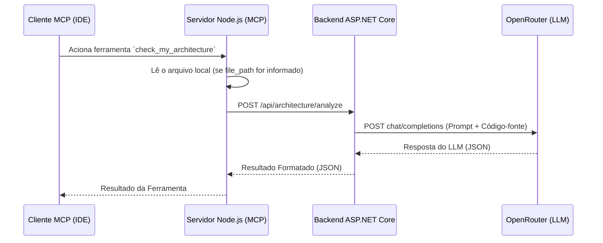

# Documentação Técnica de Arquitetura

## Visão Geral

O projeto **Architecture Analysis MCP** fornece um servidor local Model Context Protocol (MCP) que analisa o código-fonte em busca de melhorias arquiteturais, focando especificamente em princípios SOLID, acoplamento, coesão e Padrões de Projeto (Design Patterns).

O sistema é composto por dois componentes principais:
1. **Backend ASP.NET Core (Camada Lógica e de Proxy)**
2. **Servidor MCP em Node.js (Camada de Integração e Transporte)**

---

## 1. Servidor MCP (Node.js)

O servidor MCP atua como a ponte entre IDEs/Clientes MCP e o motor de análise no backend. Ele roda localmente e expõe ferramentas para o cliente.

- **Stack**: Node.js, TypeScript, SDK `@modelcontextprotocol/sdk`
- **Ferramenta Exposta**: `check_my_architecture`
- **Responsabilidades**: 
  - Recebe as requisições de análise do cliente MCP.
  - Lê o conteúdo do arquivo no disco local (se o caminho for fornecido).
  - Encaminha o payload (código-fonte, caminho do arquivo, modelo LLM e contexto) para o Backend ASP.NET Core.

### Variáveis de Ambiente
- `BACKEND_URL`: URL do backend ASP.NET (Padrão: `http://localhost:5000`)
- `BACKEND_ENDPOINT`: Endpoint da API (Padrão: `/api/architecture/analyze`)
- `DEFAULT_LLM_MODEL`: Modelo padrão do OpenRouter quando `llm_model` não é informado na chamada (Padrão: `openai/gpt-4o-mini`)
- `DEBUG`: Quando `true`, habilita logs detalhados via `stderr` (Padrão: `false`)

### Novas Funcionalidades (Super-Poderes)

- **Motor de Regras Customizadas**: Se houver um arquivo `.archrc.json` na raiz do projeto contendo um array de `"rules"`, o servidor MCP o lê automaticamente e aplica as regras arquiteturais específicas do time à análise.
- **Auto-Refatoração**: Passando `auto_fix: true` nos parâmetros, o sistema é capaz de não apenas sugerir, mas **gerar e sobrescrever automaticamente o arquivo** com a versão arquiteturalmente correta!
- **Diagramas de Arquitetura**: Quando uma refatoração é gerada, a ferramenta também responde com um **diagrama Mermaid** da arquitetura nova, ilustrando as dependências e componentes separados.

---

## 2. Backend ASP.NET Core

O backend é responsável por receber o payload e se comunicar diretamente com a API do OpenRouter. Ele abstrai a lógica de integração com a IA (LLM) da camada do protocolo MCP.

- **Stack**: .NET 10.0, ASP.NET Core Minimal APIs
- **Responsabilidades**:
  - Processa a requisição de análise.
  - Envia o prompt estruturado e o código para a API do OpenRouter.
  - Retorna uma resposta estruturada em JSON contendo `violations` (violações), `suggestions` (sugestões), `patterns` (padrões) e uma `analysis` (análise geral).

### Variáveis de Ambiente
- `OpenRouter__ApiKey`: A chave da API do OpenRouter.
- `OpenRouter__Referer`: Identificador de referer para o OpenRouter (Padrão: `http://localhost`).
- `OpenRouter__Title`: Título enviado no header `X-Title` para o OpenRouter (Padrão: `Architecture Analysis MCP Backend`).
- `ASPNETCORE_URLS`: URL para vincular o servidor (Padrão: `http://localhost:5000`)
- `ASPNETCORE_ENVIRONMENT`: Ambiente de execução. Em `Development`, expõe o endpoint OpenAPI em `GET /openapi/v1.json`.

### Endpoints

| Método | Rota | Descrição |
|--------|------|-----------|
| `POST` | `/api/architecture/analyze` | Analisa o código enviado e retorna o resultado estruturado. |
| `GET`  | `/health` | Verifica se o backend está no ar. Retorna `{"status":"ok"}`. |
| `GET`  | `/openapi/v1.json` | Especificação OpenAPI (disponível apenas em `Development`). |

---

## 3. Fluxo de Comunicação



## 4. Regras Customizadas (.archrc.json)

Se houver um arquivo `.archrc.json` na raiz do projeto com um array `"rules"`, o servidor MCP o lê automaticamente e inclui as regras na requisição ao backend. Isso permite que cada time defina padrões arquiteturais próprios sem alterar o código do servidor.

Exemplo:
```json
{
  "rules": [
    "Controllers não devem acessar o banco de dados diretamente. Use Repositories ou Services.",
    "O código deve priorizar a Injeção de Dependência via construtor.",
    "Utilize a Clean Architecture sempre que possível.",
    "Mantenha classes focadas em uma única responsabilidade (SRP)."
  ]
}
```

---

## 5. Payloads (Formato de Dados)

### Requisição para o Backend

```json
{
  "sourceCode": "string",
  "filePath": "string",
  "llmModel": "openrouter/auto",
  "additionalContext": "string",
  "customRules": ["Regra 1 do .archrc.json", "Regra 2"],
  "generateRefactoring": true
}
```

### Resposta Esperada do Backend

```json
{
  "analysis": "Texto de análise geral do código...",
  "violations": ["Lista de violações de SOLID e problemas arquiteturais"],
  "suggestions": ["Lista de passos práticos para refatoração"],
  "patterns": ["Padrões de projeto recomendados"],
  "confidence": 0.9,
  "refactoredCode": "public class NewArchitecture...",
  "architectureDiagram": "```mermaid\nclassDiagram...\n```",
  "metadata": {
    "provider": "OpenRouter",
    "model": "openrouter/auto",
    "generatedAtUtc": "2025-01-01T00:00:00.0000000Z"
  }
}
```

## 6. Integração com CI/CD (GitHub Actions)

Existe um template em `.github/workflows/architecture-analysis.yml` que roda em Pull Requests com alterações em arquivos `.cs` ou `.ts`. O template inicializa o backend e reserva um passo `Run MCP Analysis Script` ainda não implementado — o objetivo é que esse passo chame o endpoint `/api/architecture/analyze` para os arquivos alterados e, via `github-script`, poste o resultado como comentário no PR.

Para torná-lo funcional, adicione o secret `OPENROUTER_API_KEY` nas configurações do repositório e implemente o script de chamada à API.

## 7. Interface Padrão (MCP Inspector)

O sistema está configurado para usar o **MCP Inspector** como a interface web padrão para interagir com a aplicação, tanto no ambiente de desenvolvimento local quanto em produção. 

O MCP Inspector fornece uma UI interativa que permite listar e executar as ferramentas expostas pelo servidor (como a `check_my_architecture`) sem a necessidade de uma IDE compatível (como o VS Code).

### Como rodar a interface (Local e Produção)

No diretório `mcp-server`, utilize os seguintes comandos:

**Para ambiente de Desenvolvimento:**
```bash
npm run dev:inspector
```
*(Inicia o servidor usando `ts-node` e abre o MCP Inspector)*

**Para ambiente de Produção:**
```bash
npm run start:inspector
```
*(Inicia o servidor a partir da versão compilada na pasta `dist/` e abre o MCP Inspector)*

Após executar o comando, acesse o link gerado no terminal (geralmente `http://localhost:5173` ou `http://localhost:6274`) para abrir a interface web padrão.
